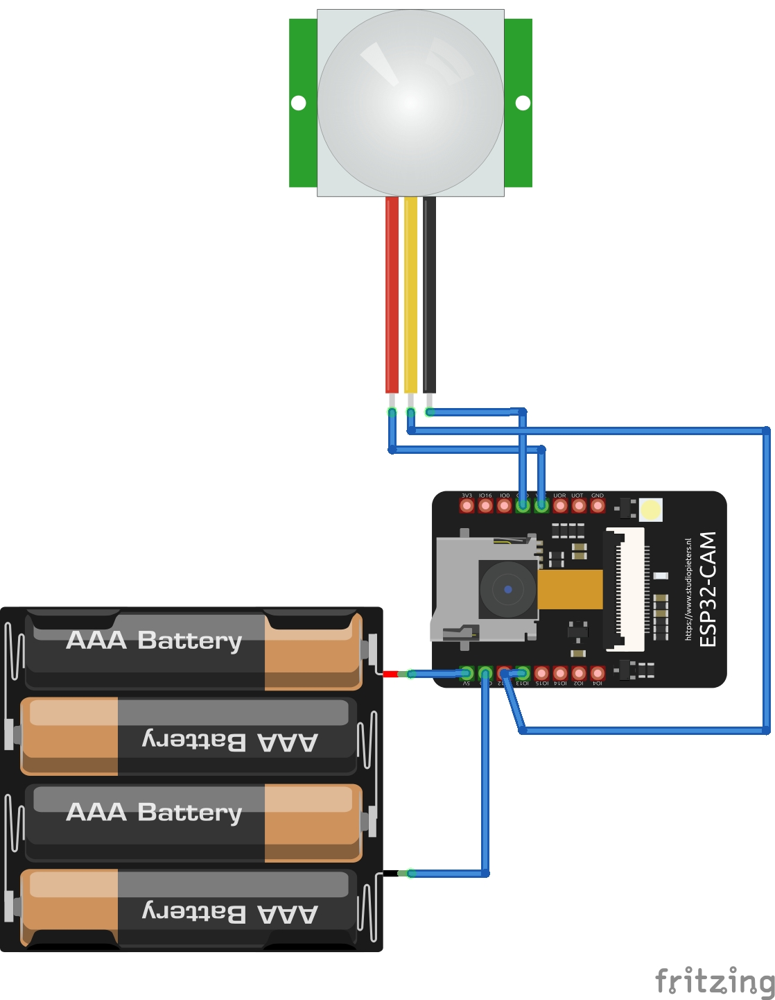

# TrailCamera

A power-efficient, motion-activated trail camera built with Arduino. This project is designed to sit quietly in the wild, waking up only to capture images when wildlife or movement is detected, and saving those images directly to an SD card.

## How It Works
The camera operates in two distinct modes to make deployment and operation as seamless as possible:

### 1. Setup Mode (Wireless Access Point)
Upon first starting up, the camera broadcasts its own Wi-Fi network, acting as an Access Point. By connecting your phone or laptop to this network, you can access a web interface that provides:
* **Live View:** Stream a live feed from the camera to help you perfectly frame and position your shot in the wild.
* **Gallery & Download:** View and download previously captured wildlife photos directly to your device without removing the SD card.
* **Clear Storage:** Easily wipe the SD card to prepare for a brand-new deployment.
* **Arm Camera:** A button to exit Setup Mode, sync the camera's internal Real-Time Clock (RTC) to your browser's time for accurate photo file timestamps, and put the camera into its ultra-low-power deep sleep mode to begin monitoring.

> **Note:** Take a screenshot of the Setup Mode web interface and save it as `UI_Screenshot.jpg` in this directory to display it here.

!Web Interface UI

### 2. Trail Mode (Deep Sleep)
Once the device is physically deployed and armed via the web interface:
1. **Standby:** The system shuts down its Wi-Fi and enters an ultra-low-power deep sleep mode.
2. **Motion Detection:** A PIR sensor continuously monitors the area for heat/movement signatures.
3. **Wake Up:** Upon detecting motion, the PIR sensor triggers a hardware interrupt, immediately waking the microcontroller from deep sleep.
4. **Capture & Store:** The camera module powers up, captures an image, and writes the file to the SD card.
5. **Sleep:** The system automatically returns to deep sleep to wait for the next trigger.

## Why Deep Sleep?
Trail cameras are typically deployed outdoors and rely completely on battery power for weeks or months at a time. If the processor and camera were running continuously, the batteries would die in a matter of hours. By utilizing **deep sleep**, the microcontroller shuts down non-essential internal clocks and peripherals (like the camera and SD card reader), dropping its power draw to mere microamps. It only consumes significant power for the brief moments it is awake to take a picture, massively extending the battery life of the device.

## Wiring & Pinouts
Wire up the components as detailed below, then compile and upload the software using the Arduino IDE. 

| Component | Pin | Description |
| :--- | :--- | :--- |
| **Power System** | `5V` / `GND`| Powered by 6V (4x AA batteries) connected to the board |
| **PIR Sensor VCC** | `3.3V` | Powered from the ESP32 3.3V pin |
| **PIR Sensor GND** | `GND` | Ground connection |
| **PIR Sensor Out** | `Pin 13` | Hardware interrupt to wake the board from deep sleep |
| **SD Card & Camera**| `Built-in`| Using the ESP32-CAM's onboard micro SD slot (1-bit mode) and camera |

